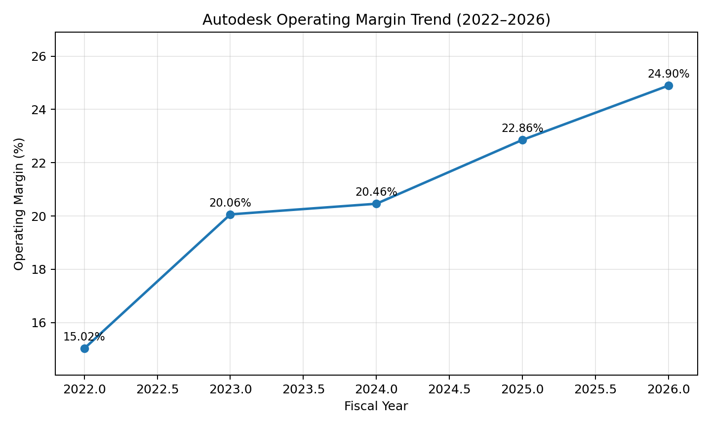

# ADSK Business Operations (Q1–Q4) — CN & EN Draft

> 作业文件：ADSK-Final-2026（Business operations 部分）  
> 主要数据：ADSK-Data-February-2026-Students.xlsx + ADSK_2025_Annual_Report.pdf

---

## 中文答案（修改用）

### Q1. Autodesk 做什么？（尽量按年报原文）

**年报原文（Item 1, Business, General）**：

> “We are a global leader in 3D design, engineering and entertainment technology solutions, spanning architecture, engineering, construction, product design, manufacturing, media, and entertainment. Our customers design, fabricate, manufacture, and build anything by visualizing, simulating, and analyzing real-world performance early in the design process. These capabilities allow our customers to foster innovation, optimize their designs, streamline their manufacturing and construction processes, save time and money, improve quality, deliver more sustainable outcomes, communicate plans, and collaborate with others. Our professional software products are sold globally through a combination of indirect and direct channels.”

**可直接写法（中文）**：
Autodesk 是一家全球领先的 3D 设计、工程与娱乐技术公司，覆盖建筑、工程、施工、产品设计、制造、媒体与娱乐等场景。其核心价值在于：帮助客户在设计早期进行可视化、仿真和性能分析，从而提升创新效率、优化流程、改善质量并增强协作。公司通过直销与间接渠道结合进行全球销售。

**你问的“公司强调”那句在哪**：
- “We dedicate considerable technical and financial resources to research and development to deliver additional automation and insights... through artificial intelligence (AI), machine learning, and generative design...”
- 位置：**ADSK_2025_Annual_Report.pdf，Item 1（Business）内，约 PDF 第 8 页中段（Subscription/产品能力描述段落）**。

---

### Q2. 主要竞争者（按分部）+ 是否有壁垒

**竞争名单在年报哪里**：
- 位置：**ADSK_2025_Annual_Report.pdf，Item 1 → COMPETITION，约 PDF 第 11 页**。
- 年报列出的主要全球竞争者包括：Adobe、Bentley、Dassault Systèmes（含 SolidWorks）、Hexagon（Intergraph/MSC）、Nemetschek、Oracle、Procore、PTC、3D Systems、Siemens PLM、Trimble 等。

**按分部归类（作业可用）**：
1. **AECO**：Bentley、Procore、Trimble、Nemetschek 等
2. **AutoCAD & LT**：多类 CAD 工具（含 Dassault/PTC/Siemens 在部分场景的重叠竞争）
3. **MFG**：Dassault、Siemens PLM、PTC、Hexagon/MSC、3D Systems
4. **M&E**：Adobe 及其他数字内容工具

**壁垒判断（贴近 S11 + Lecture 8 ADBE 话术）**：
- 真正护城河不是“某个单点功能”，而是 **workflow lock-in（工作流锁定）+ enterprise relationship（企业关系）+ switching costs（切换成本）**。
- 企业客户不是只买软件，而是买“流程可运行性”：文件/模型兼容、团队协作、历史项目数据、上下游伙伴配合、培训和治理体系。
- 因此，AI 可能降低入门门槛，但短期更难打穿企业级工作流护城河。

---

### Q3. 近几年 operating margin 走势，是否出现下滑？AI 是否已体现在盈利里？

我已按 xlsx 数据生成图：  

图文件路径：
- Assignment/ADSK/images/ADSK-operating-margin-2022-2026.png

**计算口径（xlsx: Basic data, Op. Income / Revenues）**：
- 2022: 15.02%
- 2023: 20.06%
- 2024: 20.46%
- 2025: 22.86%
- 2026: 24.90%

**结论**：没有看到 slump，反而是持续改善。  
若看年报口径（Item 7, Other Financial Information，约 PDF 第 57 页）：
- GAAP operating margin: 21% → 22% → 22%（FY2024→FY2026）
- Non-GAAP operating margin: 36% → 36% → 38%

所以“AI 已经明显伤害 ADSK 盈利能力”这一命题，目前证据不足。

---

### Q4. AI 会威胁 ADSK 商业模式吗？以及“版权/商用合规优势”有没有？

**结论（可提交）**：
- AI 会带来压力，但短中期不太可能打穿 ADSK 商业模式；更像“重构产品形态和交付方式”，而不是“直接替代核心系统”。

**理由（对齐 ADBE 逻辑）**：
1. 客户习惯与工作流锁定强（企业端协作链条长，替换成本高）
2. 产品生态与平台集成深（不是单工具，而是多产品协同）
3. 关键经营指标仍稳（高 recurring、NR3 区间仍健康、RPO 增长）

**“版权/商用”这一点如何写（务实版）**：
- ADSK **有“知识产权与许可治理”优势，但不等同于 ADBE 那种“海量可授权创意素材库”的优势强度**。
- 年报在 Item 1 的 Intellectual Property and Licenses（约 PDF 第 12 页）明确强调：专利/版权/商标/商业秘密保护、许可体系与侵权风险管理。
- 这有助于企业级商用合规与风险控制，但“生成式内容版权护城河”在 ADSK 上不应过度类比 ADBE。

---

## English Answers (submission-ready)

### Q1. What does Autodesk do?

Autodesk describes itself as follows (Item 1, Business, General):

> “We are a global leader in 3D design, engineering and entertainment technology solutions, spanning architecture, engineering, construction, product design, manufacturing, media, and entertainment. Our customers design, fabricate, manufacture, and build anything by visualizing, simulating, and analyzing real-world performance early in the design process. These capabilities allow our customers to foster innovation, optimize their designs, streamline their manufacturing and construction processes, save time and money, improve quality, deliver more sustainable outcomes, communicate plans, and collaborate with others. Our professional software products are sold globally through a combination of indirect and direct channels.”

In short, Autodesk provides integrated design-and-engineering software workflows across AECO, AutoCAD/LT, manufacturing, and media/entertainment, with a hybrid desktop-plus-cloud subscription model.

Reference for the “company emphasizes AI” sentence:
- “We dedicate considerable technical and financial resources... through artificial intelligence, machine learning, and generative design... ”
- Location: ADSK_2025_Annual_Report.pdf, Item 1 (Business), around PDF page 8.

---

### Q2. Main competitors by segment, and barriers to entry

**Where is the competitor list in the annual report?**
- ADSK_2025_Annual_Report.pdf → Item 1 → COMPETITION (around PDF page 11).

**Segment view:**
- AECO: Bentley, Procore, Trimble, Nemetschek (and selected overlap with others)
- AutoCAD & LT: broad CAD competition (including partial overlap with Dassault/PTC/Siemens)
- MFG: Dassault, Siemens PLM, PTC, Hexagon/MSC, 3D Systems
- M&E: Adobe and other digital-content tools

**Barrier-to-entry view:**
Autodesk’s moat is closer to **workflow lock-in + enterprise relationship + switching costs**, not only single-feature superiority. Enterprise customers are locked into process continuity (collaboration, compatibility, historical project data, implementation know-how), which is difficult to replace quickly even if AI lowers entry barriers for lightweight tools.

---

### Q3. Operating margin trend over recent years: any slump? Is AI visible in profitability?

Using ADSK-Data-February-2026-Students.xlsx (Basic data: Operating Income / Revenue), operating margin is:
- 2022: 15.02%
- 2023: 20.06%
- 2024: 20.46%
- 2025: 22.86%
- 2026: 24.90%

So there is **no slump** in recent years; margins improved.

Chart generated:
- Assignment/ADSK/images/ADSK-operating-margin-2022-2026.png

Annual-report consistency check (Item 7, around PDF page 57):
- GAAP operating margin: 21% → 22% → 22% (FY2024→FY2026)
- Non-GAAP operating margin: 36% → 36% → 38%

Therefore, current data does not support the claim that AI has already caused a clear deterioration in ADSK profitability.

---

### Q4. Will AI threaten ADSK’s business model? Why/why not? Any copyright/commercial-use advantage?

AI is a real strategic risk, but in the short-to-medium term it is more likely to **reshape** Autodesk’s product and workflow architecture than to break its business model.

Why:
1. Strong workflow lock-in in enterprise design/build/make processes.
2. Ecosystem and integration depth across product families.
3. Operating evidence remains resilient (recurring profile, NR3 range, RPO growth, stable-to-improving margins).

On copyright/commercial-use advantage:
- Autodesk does have a meaningful **IP and licensing governance** layer (Item 1, Intellectual Property and Licenses, around PDF page 12), which supports enterprise commercial compliance.
- However, this should not be overstated as equivalent to Adobe’s “permissioned content library” moat in generative creative content.

---

## 关键引用定位（便于你答辩时快速翻）

- Item 1 Business（General）: 约 PDF page 5
- Item 1 AI/ML/generative design 句子: 约 PDF page 8
- Item 1 COMPETITION（竞争名单）: 约 PDF page 11
- Item 1 Intellectual Property and Licenses: 约 PDF page 12
- Item 7 NR3/Recurring（管理层讨论）: 约 PDF page 45
- Item 7 Net Revenue by Product Family: 约 PDF page 48
- Item 7 GAAP/Non-GAAP operating margin 表: 约 PDF page 57
- Item 8 Note 2（Revenue, RPO）: 约 PDF page 78
