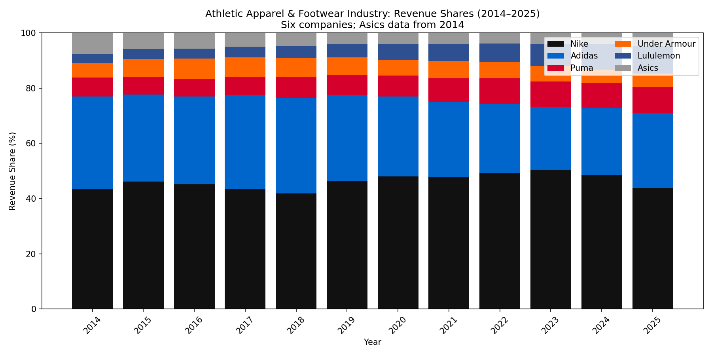
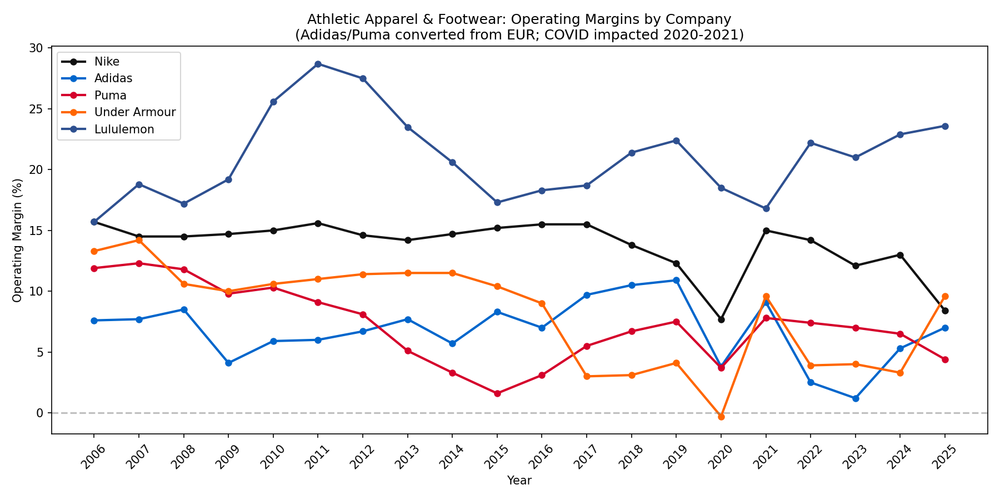

# Nike Homework: Q1–Q2 Answers

## Question 1: Industry Revenue Shares (2014–2025)

### Chart

### Is any company gaining ground at the expense of others?

**Yes.** From the revenue-share data (2014–2025):

| Company      | 2014 | 2025 | Change    |
|-------------|------|------|-----------|
| Nike        | 43.4%| 43.8%| +0.4 pp   |
| Adidas      | 33.5%| 27.1%| −6.4 pp   |
| Puma        |  6.9%|  9.5%| +2.6 pp   |
| Under Armour|  5.4%|  4.8%| −0.6 pp   |
| Lululemon   |  3.1%| 10.0%| +6.9 pp   |
| Asics       |  7.7%|  4.7%| −3.0 pp   |

- **Lululemon** gained the most share, from 3.1% to 10.0%.
- **Puma** also gained, from 6.9% to 9.5%.
- **Adidas** lost the most share, from 33.5% to 27.1%.
- **Asics** lost share, from 7.7% to 4.7%.
- **Nike** share was roughly flat over the full period, but peaked at 50.4% (2023) before dropping to 43.8% in 2025.
- **Under Armour** lost share, from 5.4% to 4.8%.

### Why?

1. **Lululemon**  
   - Strong position in athleisure and yoga/studio wear, particularly among women.  
   - Premium pricing and loyal customer base.  
   - DTC focus and community marketing.  

2. **Puma**  
   - Brand refresh and product innovation.  
   - Solid performance in football, motorsport, and lifestyle categories.  
   - Gains partly at Adidas’s expense.  

3. **Adidas**  
   - Weakness in China (Yeezy exit and geopolitical pressure).  
   - Inventory problems and restructuring costs.  
   - Execution issues versus Nike and emerging competitors.  

4. **Nike (2023–2025 decline)**  
   - Softer demand in North America and China.  
   - Competition from On, Hoka, and Lululemon.  
   - Ongoing wholesale strategy adjustments.  

5. **Asics**  
   - Smaller global scale versus Nike/Adidas.  
   - More limited DTC and brand reach.  

---

## Question 2: Operating Margins

### Chart

### Which company has the highest operating margins?

**Lululemon** has the highest operating margins over the period.

Approximate ranges (from data):

- **Lululemon**: 15.7%–28.7%, ~23.6% in FY2025  
- **Nike**: 7.7%–15.7%, ~8.4% in FY2025  
- **Adidas**: 1.2%–10.9%, ~7.0% in FY2025  
- **Puma**: 1.6%–12.3%, ~4.4% in FY2025  
- **Under Armour**: −0.3% to 14.2%, ~9.6% in FY2025  

Lululemon’s premium, DTC-led model supports higher pricing and margins than the more wholesale-oriented athletic brands.

**Note:** Asics operating income is not provided in the data, so Asics is not included in the operating-margin chart or comparison.

### Are margins stable?

**No.** Margins are volatile across companies and over time:

1. **Lululemon** – Most stable and consistently high (roughly 16–29%). Some variation around COVID and expansion.  

2. **Nike** – Moderate volatility: 12–16% in normal years, dipped to 7.7% in FY2020 (COVID), 8.4% in FY2025 (demand and margin pressure).  

3. **Adidas** – Highly volatile: 2.5% in 2022, 1.2% in 2023 due to China, Yeezy, and restructuring; recovered to 7.0% in 2025.  

4. **Puma** – Considerable swings: low single digits in 2014–2016, then improvement; 2020 COVID dip and ongoing variability.  

5. **Under Armour** – Very unstable: negative (−0.3%) in FY2020, swings from 3% to 14% over the decade; recent rebound to ~9.6% in FY2025.  

COVID (2020–2021) clearly pressured margins for most firms; Adidas also faced brand-specific and China issues in 2022–2023.

---

## Question 2: Nike – Asset Value

Per the framework: **Asset Value = Total assets (from balance sheet) + Brand (intangible)**. Other adjustments are ignored for now.

From the **Balance Sheet** (FY2025, $mn):
- Total assets: **36,579**
- Brand value (from capitalization or triangulation): **~$35 bn** (reasonable range $32–40 bn)

**Asset Value = 36,579 + 35,000 ≈ $71.6 bn**

---

## Data Source

- **Data**: `NKE-Homework-2026-1.xlsx`, sheet "Industry"  
- **FX**: Adidas and Puma converted from EUR to USD using annual rates from the sheet; Asics from JPY to USD  
- **Period**: Revenue shares from 2014 (first full year of Asics data); operating margins from 2006  
