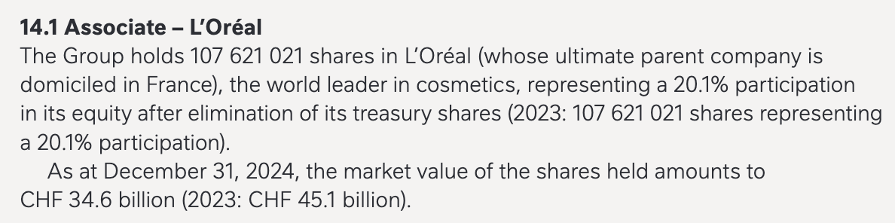
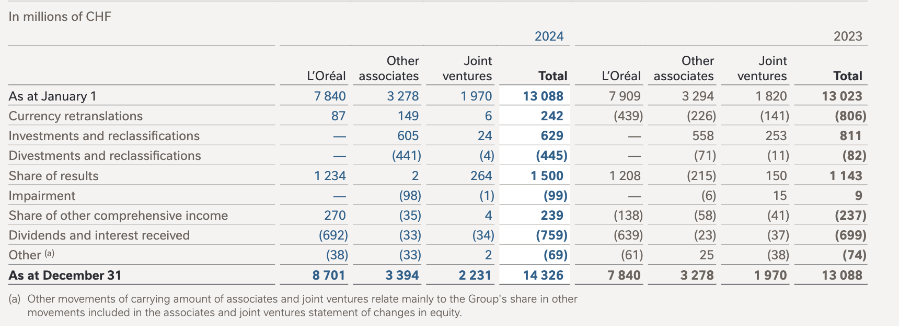
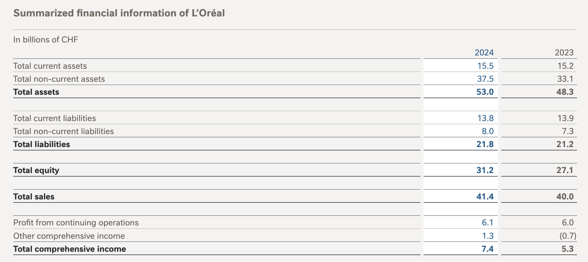
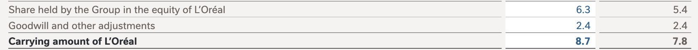

Nestlé – Homework 2026
Value Investing – Spring 2026

Taylor Swift et al. (Group Names Here)

**Note:** All figures and comparisons in this submission are based on **Nestlé’s 2024 FY annual report** and the **Nestle-Homework-2026-Data.xlsx** spreadsheet (data up to December 2024). No post-2024 market or financial data are used.

---

### 1. Nestlé’s stake in L’Oréal (20 points)

**Data source (so you can check against your group):** All figures below come from **Nestlé’s 2024 Financial Statements** PDF – **Note 14 “Associates and joint ventures”**. In the PDF, Note 14 starts on **page 148** of the “Consolidated Financial Statements of the Nestlé Group 2024” section (PDF page numbering in the footer: **148**, **149**, **150**, **151**). The L’Oréal-specific numbers are in **Note 14.1 “Associate – L’Oréal”** on **pages 149–150**.

**Market value vs. carrying value**

- **Market value:** Note 14.1 states explicitly: *“As at December 31, 2024, the market value of the shares held amounts to **CHF 34.6 billion**”* (2023: CHF 45.1 billion). So the **market value** of Nestlé’s L’Oréal stake at end‑2024 is **CHF 34.6 bn** (source: **page 149**, Note 14.1).
- **Carrying value:** The same note gives the **carrying amount of L’Oréal** (not the whole “associates” line): in the “Reconciliation of the carrying amount” table on **page 150**, **“Carrying amount of L’Oréal”** is **CHF 8.7 billion** (2024) and CHF 7.8 billion (2023). So the **carrying value** of the L’Oréal stake is **CHF 8.7 bn**.
- The **consolidated balance sheet** line **“Investments in associates and joint ventures”** is **CHF 14 326 million** at 31 December 2024 (Note 14 table on **page 149**: L’Oréal 8 701 + Other associates 3 394 + Joint ventures 2 231 = 14 326). So L’Oréal alone is **8 701 m CHF** (≈ 8.7 bn), and the rest is other associates and joint ventures.

**Is the L’Oréal stake an operating asset? Where is it reported?**

- Nestlé accounts for L’Oréal as an **associate** under the equity method. The stake is recorded as **“Investments in associates and joint ventures”** on the **consolidated balance sheet** (see balance sheet in the 2024 Financial Statements; the Notes reference is **Note 14**).
- In the **consolidated income statement**, L’Oréal’s earnings contribution is **not** included in sales or trading operating profit. It appears **below** the line “Profit before taxes, associates and joint ventures” and “Taxes”, in the single line **“Income from associates and joint ventures”** – **CHF 1 249 million** in 2024 (2023: CHF 1 120 million). That line is in the **Consolidated income statement for the year ended December 31, 2024** (near the start of the Financial Statements section, a few pages after “Principal exchange rates”).
- Economically, this stake behaves much more like a **financial investment / non‑operating asset** than part of Nestlé’s core food and beverage operations. In an EPV framework we therefore:
  - Value Nestlé’s **operating businesses** based on their operating profit and invested capital, and
  - Add the **market value of the L’Oréal stake** as an excess financial asset on top of the operating EPV.

---

### 2. Segment revenue and profit shares since 2007 (20 points)

Using the `Segments` sheet, we computed revenue and trading operating profit by product category from **2007–2024**, and then calculated each category’s **share of total revenue** and **share of total trading operating profit**. The resulting time series and plots are in:

- `Output/q2_segment_revenue_profit_shares.csv`
- `Output/q2_revenue_shares.png`
- `Output/q2_profit_shares.png`

**Main trends in revenue and profit shares**

Looking at the product groups – Powered & Liquid Beverages, Water, Milk Products, Nutrition & Healthcare, Prepared Dishes & Cooking Aids, Confectionary and Petcare – several patterns stand out:

- **Petcare**: its **revenue share rises steadily** and its **profit share rises even more**, reflecting strong growth, high margins and increasing strategic importance.
- **Nutrition & Healthcare**: revenue and profit shares increase in the 2000s and early 2010s as Nestlé builds its infant nutrition and health‑science franchises, but show **more volatility and pressure in the last decade**, especially around regulatory and competitive changes in key markets (notably China).
- **Prepared Dishes & Cooking Aids** and **Confectionary**: their shares in both revenue and profit gradually **decline or stagnate**, consistent with slower growth categories and somewhat more commoditized businesses.
- **Milk Products and Water**: these tend to **lose relative profit share** over time despite still meaningful revenue shares, reflecting lower structural margins and/or rising input and distribution costs.

Overall, value creation becomes **more concentrated** in a subset of high‑quality, brand‑ and system‑driven businesses (Petcare, premium beverages, parts of Nutrition & Healthcare) while several traditional categories lose relative weight.

**What happened to the profitability of the Nutrition business?**

- The `Segments` sheet shows that **Nutrition & Healthcare** enjoyed **very high operating margins** in the early years, but:
  - Margins **compress meaningfully** in the last decade, and
  - Profit contribution becomes more volatile.
- A key driver is the **infant nutrition business in China**, where:
  - Regulation tightened,
  - Competition from strong local brands intensified, and
  - Channel and consumer preferences shifted.

This pattern connects directly to our in‑class discussion of **Walmart and China**:

- **“Growth is the enemy.”** In class we argued that a competitive advantage based on **economies of scale bundled with customer captivity** is eroded when the **market grows faster than you**. If Walmart grows retail at 10% for almost a decade but the Chinese retail market grows at ~15% per year, Walmart’s **market share goes down mechanically**. So at the end of that cycle the company has **less** economy of scale, not more—hence the point that “Walmart can never dominate China” in that setting.
- **Nestlé Nutrition in China** is analogous: even if Nestlé grows in infant nutrition, when the **local market (and local competitors) grow faster**, Nestlé’s share and thus its scale advantage can shrink. That undermines the economics of scale + captivity and helps explain why margins and profitability in Nutrition have compressed.
- We also saw that **Walmart International** had a very low ROIC (around 1–2% before they sold Germany, South Korea, Japan, Brazil, UK, etc., and still only ~7.4% for the international segment versus ~15% for Walmart USA)—a **massive misallocation of capital**. Nestlé’s heavy capital and marketing commitment to Nutrition in China, with margins and returns coming under pressure, echoes that lesson: **investing heavily in a fast‑growing market where you cannot gain or sustain share and scale can amount to misallocation**, and we should be cautious extrapolating past high ROIC in such markets.

---

### 3. Earnings Power Value (EPV) – quick & dirty and sum‑of‑the‑parts (30 points)

#### 3.1 Quick & dirty EPV for the consolidated company

We start with Nestlé’s 2024 operating profit (before associates) of **14 724** m CHF. Using the average effective tax rate over 2020–2024 of **20.4%**, we calculate NOPAT as 14 724 × (1 − 0.204) = **11 726** m CHF.

To adjust for growth expenses, we treat a portion of marketing expenses as brand-building investments rather than maintenance costs. With marketing expenses of **18 112** m CHF in 2024, we assume 30% represents growth, which after tax equals 18 112 × 30% × (1 − 0.204) = **4 327** m CHF. Adding this back gives us adjusted NOPAT (earnings power) of **16 053** m CHF.

We use a discount rate of **7%**, which is reasonable for a large, diversified, defensive consumer company like Nestlé. This yields an operating EPV (enterprise value) of 16 053 / 0.07 = **229 300** m CHF.

To arrive at equity value, we subtract net debt of **46 141** m CHF (debt 51 697 minus cash 5 556), giving equity EPV excluding L’Oréal of **183 200** m CHF. The L’Oréal stake is not part of operating earnings but belongs to shareholders; we add its market value of **34 600** m CHF (per Note 14.1) to obtain **equity EPV including L’Oréal of 217.8 bn CHF**.

Nestlé’s market capitalization at end‑2024 was **261.7 bn CHF**, which exceeds our EPV estimate. This suggests the market is pricing growth options. Under alternative assumptions (e.g., a lower discount rate or different growth‑marketing percentage), EPV can move into the CHF 230–250bn range.

#### 3.2 Sum‑of‑the‑parts EPV by product segment

For each of the seven product segments, we compute normalized NOPAT using 2024 sales × 5‑year average margin (2020–2024) and apply segment‑specific discount rates reflecting business risk and defensiveness:

| Segment                        | 2024 Revenue | NOPAT (norm.) | Discount rate | EPV (segment) | Rationale |
| ------------------------------ | -----------: | ------------: | ------------: | ------------: | ---------- |
| Powered & Liquid Beverages     |       24 598 |      ≈ 4 063 |          7.0% |     ≈ 58 046 | Strong brands, defensive |
| Water                          |        3 180 |      ≈   174 |          8.0% |     ≈  2 172 | More cyclical, competitive |
| Milk Products                  |       10 397 |      ≈ 1 943 |          7.5% |     ≈ 25 915 | Moderate risk |
| Nutrition & Healthcare         |       15 137 |      ≈ 1 544 |          8.0% |     ≈ 19 307 | Emerging market exposure, regulatory risk |
| Prepared Dishes & Cooking Aids |       10 711 |      ≈ 1 384 |          8.0% |     ≈ 17 301 | More commoditized |
| Confectionary                  |        8 449 |      ≈   968 |          8.0% |     ≈ 12 087 | Competitive, cyclical |
| Petcare                        |       18 882 |      ≈ 3 131 |          6.5% |     ≈ 48 170 | High growth, strong moat, defensive |
| **Sum of segments**            |             |               |               |     ≈ 183 000 |
| Corporate center (negative)   |             |               |               |     ≈ −28 300 |
| **Total operating EPV**        |             |               |               |     ≈ 154 700 |
| Less net debt                  |             |               |               |     ≈ −46 100 |
| **Equity EPV (ex‑L’Oréal)**   |             |               |               |     ≈ 108 600 |
| Add L’Oréal stake (market value)|             |               |               |     ≈ +34 600 |
| **Equity EPV (including L’Oréal)** |         |               |               |     ≈ **144.2 bn CHF** |

(Exact numbers in `Output/q3_sotp_segments.csv`.)

**Conclusion:** SOTP EPV (144.2 bn) < Quick & dirty EPV (217.8 bn) < Market cap (261.7 bn). The conservative SOTP uses higher segment discount rates and fully charges corporate overhead, suggesting the market prices growth options and synergies across segments.

---

### 4. ROIC by segment and for the consolidated company (30 points)

#### 4.1 Segment ROIC with and without goodwill/intangibles

Using the `Inv. Capital & Gdwill, Distr.` sheet, we constructed, for each product segment and year 2008–2024:

- **Invested capital excluding goodwill and intangibles** (IC\_noGW),
- **Goodwill and identifiable intangible capital** (IC\_GW),
- **EBIT (trading profit)** by segment.

Pre‑tax ROIC measures:

- \( \\text{ROIC}^{\\text{pre}}_{\\text{noGW}} = \\dfrac{EBIT}{IC\\_{\\text{noGW}}} \)
- \( \\text{ROIC}^{\\text{pre}}_{\\text{withGW}} = \\dfrac{EBIT}{IC\\_{\\text{noGW}} + IC\\_{\\text{GW}}} \)

Averaging 2008–2024, we obtain (approximate values):

| Segment                                  | Avg pre‑tax ROIC excl. GW | Avg pre‑tax ROIC incl. GW |
| ---------------------------------------- | -------------------------: | -------------------------: |
| P & LB (Powered & Liquid Beverages)      |              **78%** |              **57%** |
| MP & IC (Milk Products & Ice Cream)      |                        64% |                        39% |
| PD & CA (Prepared Dishes & Cooking Aids) |                        57% |                        22% |
| PetCare                                  |                        63% |                        18% |
| Confect.                                 |                        46% |                        32% |
| N & HS (Nutrition & Health Science)      |                        42% |                         9% |
| Water                                    |                        21% |                        13% |

The CSV with full numbers is in `Output/q4_roic_segment_pre_tax_avg.csv`.

**Which segment has the highest ROIC (with and without goodwill)? Why?**

- The **Powered & Liquid Beverages (P & LB)** segment has the **highest pre‑tax ROIC both excluding and including goodwill**, with average ROICs of about **78% (no GW)** and **57% (with GW)**.
- This reflects:
  - Very strong **brand portfolios** (e.g., coffee, cocoa, soluble drinks),
  - A **capital‑light model** with manufacturing and distribution leveraging Nestlé’s global footprint,
  - High **pricing power and repeat purchase behavior**, leading to high margins relative to invested tangible capital.

**A segment where missing intangibles particularly matter**

- Several segments have extraordinarily high ROIC **if goodwill and intangibles are excluded**, especially **P & LB and PetCare**. For these, ignoring missing (unrecorded) intangibles is particularly misleading.
- Consider **PetCare**:
  - The business relies heavily on **brands, customer relationships, veterinary channels, and accumulated know‑how**, most of which is not fully captured on the balance sheet as capital.
  - If we ignore **both recorded goodwill and unrecorded intangibles**, the segment appears to have a **60%+ pre‑tax ROIC**, which overstates its true underlying capital intensity.
- In economic terms, the true “capital base” of PetCare (and beverages) includes:
  - **Brand equity**,
  - **Consumer loyalty and data**,
  - **Formulas and R&D**,
  - **Distribution systems and installed equipment (e.g., machines, feeders)**.
- Because a large share of this capital was **built organically** and never capitalized, **reported ROIC excluding goodwill can be extremely high**, even though the real economic ROIC is lower (though still very attractive).

#### 4.2 What happened in 2018?

Looking at the time series for **P & LB** and **N & HS**, the year **2018** is notable:

- Invested capital including goodwill/intangibles in these segments **jumps sharply** around 2018, while EBIT does not increase proportionally.
- This coincides with Nestlé’s **Starbucks consumer‑packaged‑goods (CPG) coffee deal** and related acquisitions/brand rights transactions, which added **large amounts of goodwill and identifiable intangibles** to the balance sheet.

Consequences for ROIC:

- Because the **denominator (capital with GW)** increases suddenly while the **numerator (EBIT)** takes time to catch up, the **reported ROIC including goodwill drops abruptly** in 2018 for the affected segments.
- This illustrates how **acquisition accounting can mechanically depress ROIC**, even when the underlying business economics and long‑term prospects remain strong.

#### 4.3 Consolidated ROIC (with goodwill) and growth from reinvestment

Using the **TOTAL** rows in `Inv. Capital & Gdwill, Distr.`:

- 2024 invested capital excluding goodwill/intangibles: **33 253** m CHF
- 2024 goodwill and intangible capital: **48 985** m CHF
- 2024 EBIT (trading profit): **14 633** m CHF

Thus, the **consolidated pre‑tax ROIC (with goodwill) in 2024** is:

- \( \\text{ROIC}^{\\text{pre}}_{\\text{withGW}} \\approx \\dfrac{14 633}{33 253 + 48 985} \\approx 17.8\\% \)

Applying the same average tax rate as before (~20.4%), the **after‑tax ROIC including goodwill** is:

- \( \\text{ROIC}^{\\text{after}}_{\\text{withGW}} \\approx 14.2\\% \)

Given that **growth capex as a fraction of NOPAT is about 0.15**, the implied long‑term growth rate from reinvestment is:

- \( g \\approx \\text{Reinvestment rate} \\times \\text{ROIC}^{\\text{after}} \\approx 15\\% \\times 14.2\\% \\approx 2.1\\% \\) per year.

So, if Nestlé continues to reinvest roughly 15% of NOPAT at its current after‑tax ROIC (including goodwill), we would expect **long‑run earnings growth of roughly ~2%** purely from reinvestment of retained earnings.

#### 4.4 Long‑run EBIT growth and comparison

From the `Revenues, Op. Incomes, Taxes` sheet, we computed:

- Annual **EBIT growth** from 1981 onward:\( g_t = \\dfrac{EBIT_t}{EBIT_{t-1}} - 1 \)
- A **7‑year trailing average** of EBIT growth:
  \( \\overline{g}_t^{(7)} = \\dfrac{1}{7} \\sum_{k=0}^{6} g_{t-k} \)

The resulting series and chart are saved as:

- `Output/q4_ebit_growth_series.csv`
- `Output/q4_ebit_growth_smoothed.png`

Key observations:

- The **annual EBIT growth** series is quite volatile, with spikes around major acquisition waves and downturns during crises (e.g., GFC, COVID, commodity shocks).
- The **7‑year smoothed EBIT growth** is much more stable and, in recent years, has converged to a **low single digit** level.
- As of the last year in the dataset (2024), the **7‑year trailing average EBIT growth** is about **1.5% per year**.

**Comparison with the growth rate implied by reinvestment**

- The **growth implied by reinvestment** (reinvesting 15% of NOPAT at a 14.2% after‑tax ROIC) is about **2.1%**.
- The **historical 7‑year smoothed EBIT growth** (through 2024) is around **1.5%**.

The two figures are **reasonably close** and well within the range of estimation error:

- The historical number is affected by **cyclical factors, FX, mix shifts and timing of acquisitions/disposals**.
- The implied growth rate from reinvestment is a **steady‑state estimate** based on 2024 ROIC and the given reinvestment rate.

Taken together, they support the view that Nestlé is:

- Earning **solid mid‑teens after‑tax returns** on its invested capital (including goodwill),
- Reinvesting a **modest but meaningful fraction** of its earnings,
- And thus likely capable of sustaining **low‑to‑mid single digit earnings growth** over time, consistent with a mature but still value‑creating global franchise.
